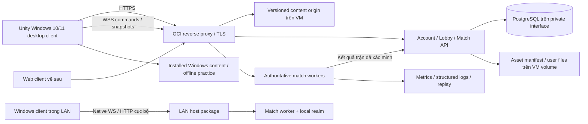

# Racing Bois — Kiến trúc đề xuất và các phép thử quyết định

Trạng thái: thiết kế tổng thể, với foundation P02 đã triển khai và kiểm thử riêng trong [P01_P02_STATUS.md](P01_P02_STATUS.md). Cập nhật 2026-09-21. Ràng buộc nguồn: [REQUIREMENTS.md](REQUIREMENTS.md).

Thiết kế code phải tuân [ENGINEERING_STANDARDS.md](ENGINEERING_STANDARDS.md); UI/UX và motion theo [UI_UX_DIRECTION.md](UI_UX_DIRECTION.md). Đây là điều kiện từ người dùng, không phải phần tùy chọn sau khi gameplay xong.

**Cập nhật ưu tiên 2026-09-26:** client chính là Unity Windows 10/11 x64; Web được thực hiện sau. Backend online và dữ liệu vẫn đặt trên OCI. Kiến trúc authority/shared simulation giữ nguyên; adapters chọn native networking, content đã cài trong StreamingAssets và audio native cho desktop. Mọi phần ghi Web phía dưới là target bổ sung hoặc bằng chứng các phase trước, không phải nghiệm thu Windows mới.

## 1. Kiến trúc tổng thể

Mỗi trận có đúng một authority. Client gửi input có sequence/tick; server tính trạng thái hợp lệ. Client dự đoán thao tác bản thân, hiển thị đối thủ qua interpolation và sửa sai bằng reconciliation. Không nhận position/HP/currency do client tự tuyên bố làm kết quả chuẩn.

## 2. Unity và gameplay simulation

Hiện trạng P02: Unity **6000.5.7f1**, URP **17.5.0**, Input System **1.20.0**, Unity MCP được pin; đã có foundation scene, asset mới và Web build. Snapshot ban đầu Built-in/Assets trống nằm trong báo cáo P00, không phải trạng thái hiện tại.

Hướng đề xuất:

- Client Unity URP, Windows 10/11 x64 và Direct3D 11 làm baseline hiện tại. WebGL2 là target bổ sung về sau; thử WebGPU riêng nếu đem lại lợi ích đo được.
- Lõi simulation C# tách khỏi MonoBehaviour: road coordinate `s` (dọc đường), `d` (lệch làn), vận tốc, heading/lean, state rider/bike, cooldown, damage và race progress. World spline/ribbon chuyển sang tọa độ render 3D.
- Máy chủ .NET chạy cùng quy tắc simulation; dữ liệu track/xe/trận là versioned content. Tránh phụ thuộc Unity physics nếu muốn chạy ARM64 VM dễ dàng. Chỉ chốt sau proof-of-concept browser ↔ native và khảo sát OCI.
- Nếu cần Unity Dedicated Server để đạt hành vi, phải thử nền tảng server/module/CPU architecture thực trước; không mặc định Linux ARM64 server Unity chạy được trên OCI A1.
- Collision gameplay ưu tiên primitive proxies và truy vấn road-space; ragdoll/debris có thể là visual-only. Vị trí tiếp đất của rider/bike, quãng chạy về xe, thời gian recovery và điều kiện remount vẫn do server quyết định vì ảnh hưởng thời gian/thứ hạng. Physics render không quyết định tiền, thứ hạng hay damage.
- Không mặc định PhysX deterministic giữa Editor, native server và WebAssembly. Dùng server correction; replay kiểm tra riêng simulation, không đồng nhất với replay vật lý Unity.
- Input System, camera follow có damping, haptic/audio feedback nếu thiết bị hỗ trợ; camera shake và motion blur tùy chỉnh để giữ đọc đường và giảm khó chịu.

Các hạn chế managed threading, networking và physics của Web phải kiểm tra trong browser build. Tài liệu Unity hiện mô tả managed C# threads không được hỗ trợ và physics khác platform có thể sai khác. [Unity Web limitations](https://docs.unity3d.com/6000.0/Documentation/Manual/webgl-technical-overview.html)

## 3. Multiplayer qua Internet

**Mặc định thử WSS server-authoritative trước** cho 8 người; nghiệm thu 16 người/trận là mục tiêu thiết kế ban đầu, chưa phải capacity đã chứng minh. WSS đơn giản cho HTTPS và firewall, nhưng TCP có head-of-line blocking khi mất gói. Phải đo mất gói/jitter từ phase nền tảng; nếu không đạt combat/driving gate thì chọn WebRTC DataChannel hoặc transport browser-compatible khác trước khi mở rộng gameplay.

Browser không mở raw UDP/TCP socket như app native. WebSocket/WebRTC phải đi qua browser API/plugin phù hợp; `ClientWebSocket` không phải lựa chọn mặc định dùng được trong Unity Web. [Unity .NET Web API support](https://docs.unity3d.com/6000.0/Documentation/Manual/web-dotnet-api-support.html)

Gói protocol đề xuất:

- Input: `protocolVersion`, `matchId`, session-bound player, `sequence`, simulation tick, throttle/brake/steer/attack actions. Giới hạn tốc độ gửi, độ dài và cửa sổ tick.
- Snapshot: authoritative tick, acknowledged input, compressed/quantized states, entities within interest range, reliable discrete event IDs.
- Simulation bước cố định đề xuất **60 Hz**; snapshots **20 Hz**; thử phương án 30 Hz nếu server budget cần và feel vẫn đạt. Render độc lập 60 fps.
- Prediction input của local player; replay input chưa được ack; remote interpolation thích nghi jitter khoảng 80–150 ms làm điểm bắt đầu tuning.
- Combat: server xác nhận reach, side, cooldown, target, state, damage; lịch sử hitbox cho bounded lag compensation được quyết định bằng test. Không cho timestamp tương lai hoặc lùi vô hạn.
- Join: authenticate → lobby → reserve slot bằng ticket ngắn hạn → validate content/protocol → ready → start barrier.
- Lobby: public/private/code, host quản lý cài đặt lobby; quyền host lobby không phải authority của simulation.
- Reconnect: resume ticket, thời hạn giữ slot, state snapshot; policy DNF/bot takeover phải nhất quán với thưởng.
- Kết quả trận có ID duy nhất, transaction/outbox/idempotency; retry không được nhân đôi reward.
- Observability: RTT đo ở ứng dụng, jitter, packet/message loss, queue depth, reconciliation magnitude, tick duration, disconnect reason.

Một VM ở một region có thể cho người ở nhiều nước kết nối nhưng **không bảo đảm latency thấp toàn thế giới**. Phase phát hành phải đo ít nhất từ Đông Nam Á, châu Âu, Bắc Mỹ. Nếu latency vượt mục tiêu, cần thêm match workers OCI ở region phù hợp, region-aware lobbies và routing; dữ liệu account vẫn có nguồn chính rõ ràng. Đây là mở rộng hạ tầng cần dự toán, chưa tự provision.

Nếu chọn WebRTC: client kết nối worker có authority, signaling qua HTTPS/WSS; thử ICE/STUN/TURN và trường hợp bị chặn UDP. TURN fallback có chi phí bandwidth, không tự giải quyết chất lượng mạng. [MDN WebRTC protocols](https://developer.mozilla.org/en-US/docs/Web/API/WebRTC_API/Protocols)

## 4. LAN offline thực sự

Trình duyệt không tự làm dedicated server/raw socket listener. Cần **LAN Host** native trên một máy trong mạng: có executable/script khởi chạy, runtime/dependencies tự chứa, web server, build Unity, toàn bộ gói nội dung cần chơi, authority match và local data store. Sau khi đã có bộ cài, khởi chạy host lần đầu phải được khi WAN tắt. Máy khác mở địa chỉ LAN/QR; không bắt login OCI để vào trận.

Hai deployment profile dùng cùng simulation/protocol:

| Online OCI | LAN offline |
|---|---|
| Account thật, inventory và currency do server quản lý | Local profiles, local inventory/campaign trong realm riêng |
| HTTPS/WSS và asset origin trên VM | Local HTTP/WS same-origin nếu browser hỗ trợ; hoặc TLS với certificate tin cậy cục bộ |
| PostgreSQL online | SQLite/local database có backup/export trên host |
| CDN ngoài VM chỉ khi sau này được chấp thuận | Không font/CDN/auth/telemetry/license call bắt buộc ra Internet |
| Match reward có authority online | Không tự nhập tiền/thưởng offline vào economy online |

Trang HTTPS công khai không được âm thầm gọi WS/HTTP của LAN; phải thử mixed-content, local-network permission và secure-context APIs trên Chrome/Edge/Firefox thực. Offline host không dựa vào managed threading của WebAssembly. Nếu native C/C++ web threads cần secure context và isolation headers, phải có cấu hình LAN tương thích hoặc build fallback không dùng chúng.

Test bắt buộc: tắt WAN trước lần khởi chạy host đầu tiên từ bộ cài tự chứa, xóa browser cache trên máy thứ hai, mở URL của host LAN, tải game và vào trận; host restart vẫn giữ local profile. Chỉ thử hai tab cùng máy không đủ nghiệm thu LAN.

## 5. Backend và dữ liệu trên OCI VM

**Triển khai P07 hiện tại:** host local dùng SQLite WAL/FULL, ràng buộc database và giao dịch nguyên tử qua `IRealmStateStore`; cả realm offline và online thử nghiệm đều dùng adapter này với database riêng, loại realm bất biến. Đây là hệ thống một host đã kiểm thử giao dịch/crash/restore, chưa phải dịch vụ OCI công khai hay benchmark tải production. PostgreSQL trong đề xuất dưới đây là quyết định hạ tầng cần đánh giá ở P09; không mô tả một database đã được cài trên VM. Chi tiết: [P07 persistence](p07/PERSISTENCE.md).

Thành phần dự kiến: reverse proxy TLS (Caddy/Nginx, chốt khi deploy), .NET account/lobby API và match workers, PostgreSQL, file storage trên block volume, backup scheduler, metrics/log retention. Redis chỉ thêm khi đã chứng minh nhu cầu nhiều instance; không bắt buộc cho bản đầu một VM.

Schema logic tối thiểu: account, session, player profile, inventory, bike ownership, wallet ledger, race result, reward transaction, lobby/membership, ban/rate-limit metadata, asset manifest/content version. Wallet là ledger có unique transaction ID; server xác minh giá và ownership. Không ghi database từng frame; match state ở RAM, durable checkpoints/kết quả theo policy.

Public chỉ dịch vụ người chơi cần (thường 443 và redirect 80 nếu sử dụng). DB, match admin, metrics và storage admin ở private/loopback. Không đưa SSH key, DB credentials hoặc signing secret vào Web build.

Người dùng đã chỉ định VM `158.180.59.36` qua SSH key path hiện có. P02 kiểm trực tiếp `jarvis01`, ARM64,4 logical CPUs, khoảng23.4 GiB RAM và chạy self-contained smoke; xem `docs/p02/oci`. Region/shape metadata, quota/billing, domain và capacity production vẫn phải xác minh trong phase hạ tầng; không lấy một smoke test làm capacity guarantee.

File origin layout đề xuất `/srv/racing-bois/{releases,assets,user-content,backups}` và database volume riêng. Build/content theo hash, immutable manifest, atomic release switch/rollback; Brotli/gzip MIME/encoding đúng cho wasm/data/js, range/cache headers cho media. Backup nằm cùng VM chỉ bảo vệ lỗi ứng dụng, không bảo vệ mất VM/volume; cần phương án OCI snapshot/backup ở failure domain khác khi làm phase hạ tầng, vẫn giữ dữ liệu vận hành trên VM theo yêu cầu.

## 6. Budget khởi điểm để prototype, chưa phải benchmark

| Hạng mục | Gate đề xuất |
|---|---|
| Reference máy đang có | i7-11800H 8C/16T, RTX 3070 Laptop; tổng RAM vật lý ~63.8 GiB; đây không phải cấu hình tối thiểu công bố |
| Target desktop medium | 1080p, trung bình ≥60 fps, frame-time p95 ≤20 ms trong replay 10 phút; có profile browser thật |
| Máy thấp hơn | Chọn thêm laptop iGPU thực, 720p/900p low ≥30 fps, p95 ≤40 ms; chưa có số đo |
| Frame pacing | Không spike >100 ms lặp lại trong đua steady-state; tách startup/shader warmup/loading |
| CPU/GPU | Mỗi phía mục tiêu p95 ≤12 ms ở medium; đo theo platform, không cộng nhầm CPU/GPU overlap |
| Server 60 Hz | p99 simulation tick <12 ms, có headroom trong ngân sách 16.67 ms; capacity quyết định bằng soak/load |
| Mạng | Thử RTT 30/80/150/250 ms, jitter 0/20/50 ms, loss 0/1/3/5%; không hứa feel giống LAN ở 250 ms |
| Bandwidth | Khởi điểm mục tiêu mỗi player: upload ≤15 KB/s, download ≤60 KB/s steady-state; báo cả burst/reliable events |
| Memory web | Mục tiêu peak process tăng thêm do game ≤1 GiB trên desktop medium; WASM heap và GPU texture memory đo riêng |
| Tải game | First playable compressed ≤50 MB, track packs tải theo nhu cầu; thử cold cache 20 Mbps và warm cache |
| Độ bền | 2 giờ soak ban đầu; 8–24 giờ trước phát hành; không tăng memory liên tục, không mất/nhân đôi giao dịch |

Đây là điểm xuất phát để điều chỉnh công khai sau đo. Chưa có game nên chưa có FPS/memory/capacity thực. Tài liệu URP nhấn mạnh đo CPU, GPU và memory theo cấu hình render. [Unity URP performance](https://docs.unity3d.com/6000.0/Documentation/Manual/urp/configure-for-better-performance.html)

## 7. Art direction và production pipeline

Giữ silhouette xe/người, camera đuổi sau thấp, đọc traffic rõ, sense of speed và cảnh quan tương phản của PC reference. Chuyển nội dung thành 3D có ánh sáng/material hiện đại; mật độ chi tiết tăng khi không che tín hiệu combat/đường. Moodboard và gameplay capture sẽ khóa art direction trước sản xuất hàng loạt.

Theo cập nhật của người dùng, **toàn bộ assets production làm mới từ đầu**, chỉ lấy bản gốc làm tham chiếu. Model/texture/rig/animation/audio/music/UI/cinematic có source mới và thiết kế mới. Dữ liệu extract nằm ngoài Unity Assets/build packs; không dùng việc re-encode/đổi màu file gốc thay cho sản xuất mới. Content mapping đảm bảo đủ bề rộng và hành động của game gốc trong một bộ tài sản mới của Racing Bois.

Blender MCP → `.blend` có source → export FBX/glTF được thử thực với phiên bản Blender/Unity → import presets → prefab → tự kiểm tra → scene gameplay → Web build → profiler. Chưa chốt format export chỉ vì tool có tên; phải thử rig, animation, axis, unit và materials end-to-end.

Budget gợi ý cho vertical slice: bike+rider gần camera khoảng 20k–40k triangles tổng ở LOD0; LOD1 ~50%, LOD2 ~20%; props thường 200–5k triangles. Đây không phải mức áp cho mọi object. Texture hero 1k–2k, props 256–1k; atlas theo biome, normal/mask packing, material sharing. Asset lớn phải chứng minh thêm giá trị thị giác nếu vượt budget.

Ưu tiên baked lighting, light probes/reflection probes và shadow giới hạn; lựa chọn post-processing theo profile. Tránh lạm dụng alpha particles, nhiều realtime lights, terrain/material pass và texture 4k. Pool sparks/dust/skid/debris; sound variation, Doppler/engine RPM và ambient layer giúp cảm giác tốc độ mà không cần tăng geometry vô hạn.

Các tài liệu Unity đã đọc dùng nhánh 6000.0 đang được cập nhật; phải xác nhận API/package compatibility trên **6000.5.7f1** và browser matrix ở phase nền tảng. Không coi tài liệu nhánh khác là kết quả test của project.
